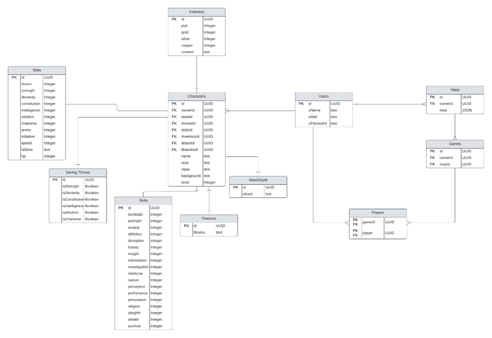

# Database
## ER model

### users
>Table for main information about users

| Name      | Purpose         | Type    | Limits    | 
| :-------- | :--------------:|:-------:| ---------:| 
| id        |User ID number   | UUID    |PK FK NN UN|
| uName     |User's name      | Text    |NN UN      |
| uMail     |Users's email    | Text    |NN UN      |
| uPassword |User's pwd       | Text    |NN         |

### maps
>Table for main information about maps

| Name      | Purpose         | Type    | Limits    | 
| :-------- | :--------------:|:-------:| ---------:| 
| id        |Map's ID number  | UUID    |PK FK NN UN|
| ownerId   |Owner ID number  | UUID    |FK NN UN   |
| data      |Map's components | JSON    |NN         |

### users
>Table for main information about users

| Name      | Purpose         | Type    | Limits    | 
| :-------- | :--------------:|:-------:| ---------:| 
| id        |User ID number   | UUID    |PK FK NN UN|
| uName     |User's name      | Text    |NN UN      |
| uMail     |Users's email    | Text    |NN UN      |
| uPassword |User's pwd       | Text    |NN         |

### users
>Table for main information about users

| Name      | Purpose         | Type    | Limits    | 
| :-------- | :--------------:|:-------:| ---------:| 
| id        |User ID number   | UUID    |PK FK NN UN|
| uName     |User's name      | Text    |NN UN      |
| uMail     |Users's email    | Text    |NN UN      |
| uPassword |User's pwd       | Text    |NN         |